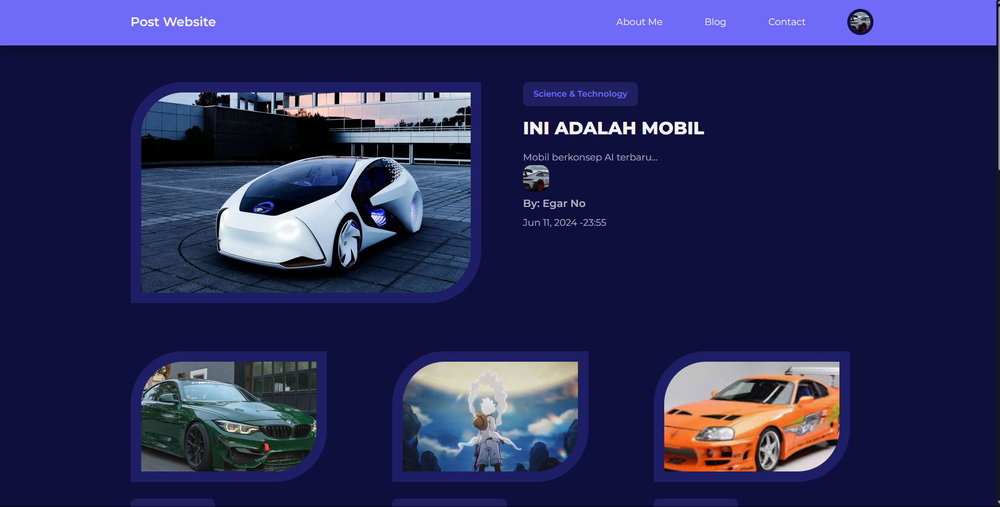
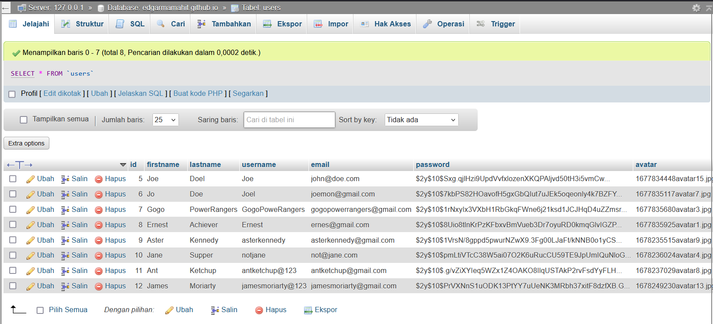
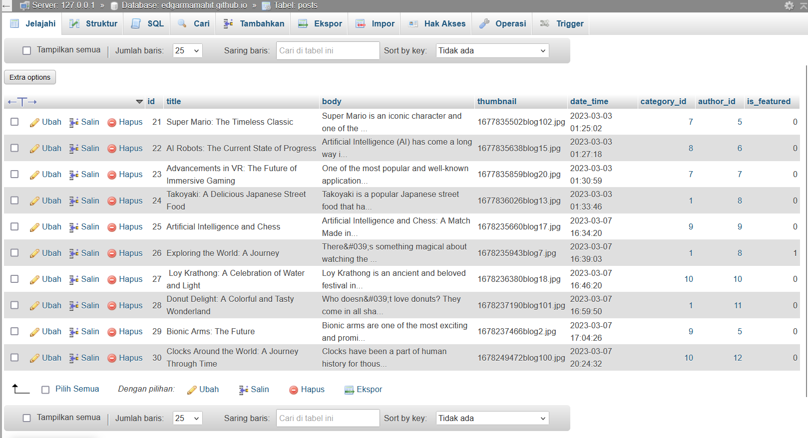
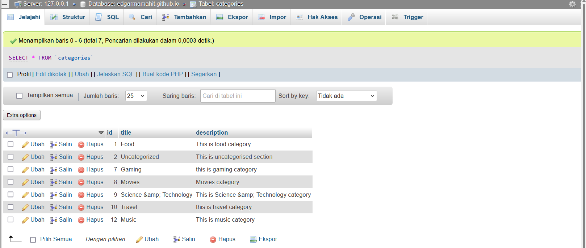

# PEMROGRAMAN WEB KELAS E
Nama: EDGAR HISKEY SAMUEL MAMAHIT 
NIM: 220211060266

# Responsive-Blog-Website

The PHP & MySQL Blog App with Admin Panel project is a web application that allows users to create and manage blog posts, categories, and users. The app is built using PHP and MySQL, two popular technologies for web development, and features a robust CRUD functionality that enables users to Create, Read, Update, and Delete posts, categories, and users.

# Technologies Used

- PHP
- MySQL
- HTML
- CSS
- JavaScript
- XAMPP Web Server

# Features

- Blog post management (CRUD functionality)
- Category management (CRUD functionality)
- User management and authentication (CRUD functionality)
- Sign in and sign up functionality
- Dashboard for users and admin
- Responsive Design
- Search funcrionality
- Live demo available

# Live Demo
|  #  | WebPage           | Live Demo                                                                               |
| :-: | ------------------|-----------------------------------------------------------------------------------------|
| 01  | Index             | [Live Demo](http://localhost/EdgarMamahit.github.io/index.php)                          |
| 02  | Blog              | [Live Demo](http://localhost/EdgarMamahit.github.io/blog.php)                           |
| 03  | Category_Post     | [Live Demo](http://localhost/EdgarMamahit.github.io/category-posts.php)                 |
| 04  | About             | [Live Demo](http://localhost/EdgarMamahit.github.io/about.php)                          |
| 05  | Contact           | [Live Demo](http://localhost/EdgarMamahit.github.io/contact.php)                        |
| 06  | Sign In           | [Live Demo](http://localhost/EdgarMamahit.github.io/signin.php)                         |
| 07  | Sign Up           | [Live Demo](http://localhost/EdgarMamahit.github.io/signup.php)                         |
| 08  | Dashboard         | [Live Demo](http://localhost/EdgarMamahit.github.io//admin/index.php)                   |
| 09  | Edit_Posts        | [Live Demo](http://localhost/EdgarMamahit.github.io/admin/edit-post.php?id=36)          |
| 10  | Add_Post          | [Live Demo](http://localhost/EdgarMamahit.github.io/admin/add-post.php)                 |
| 11  | Add_User          | [Live Demo](http://localhost/EdgarMamahit.github.io/admin/add-user.php)                 |
| 12  | Manage_Users      | [Live Demo](http://localhost/EdgarMamahit.github.io/admin/manage-users.php)             |
| 13  | Edit_User         | [Live Demo](http://localhost/EdgarMamahit.github.io/admin/edit-user.php?id=11)          |
| 14  | Add_Category      | [Live Demo](http://localhost/EdgarMamahit.github.io/admin/add-category.php)             |
| 15  | Manage_Categories | [Live Demo](http://localhost/EdgarMamahit.github.io/admin/manage-categories.php)        |
| 16  | Edit_Category     | [Live Demo](http://localhost/EdgarMamahit.github.io/admin/edit-category.php?id=13)      |

# Screenshots

- website's landing page

- users Table (for storing users data both job seeker and provider ) (user field can be seeker or provider based on they select on the sign up page)

- posts Table

- categories Table
